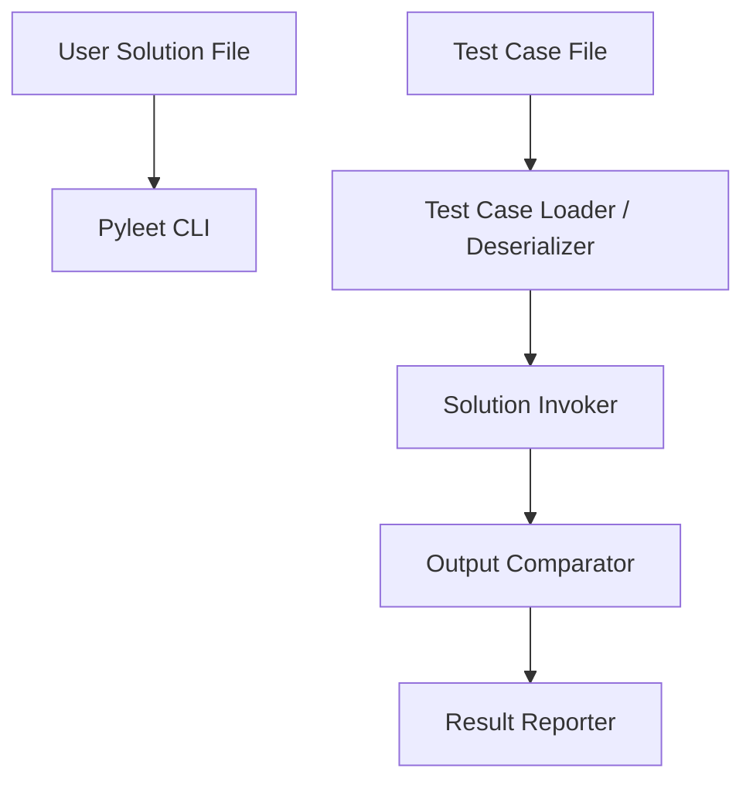

# System Patterns: Pyleet

## High-Level Architecture
Pyleet is a CLI tool that processes a LeetCode solution file, extracts embedded test cases, parses inputs, runs the solution, and reports results.

## Key Components
- **Pyleet CLI (`pyleet`)**
  - Entry point command-line interface.
  - Accepts the solution file path.
  - Coordinates the entire process.

- **Test Case Loader / Deserializer (`testcase_loader.py`)**
  - Loads test cases from an external file (e.g., `.txt` or `.json`).
  - **Parses and Deserializes:** Converts raw input data (from test case files) into Python objects *during loading*.
  - **Default Handling (JSON):** Standard JSON values (numbers, strings, lists, plain dicts) are directly converted to Python built-in types.
  - **Custom Type Handling (JSON):** Uses a registry (`pyleet.datastructures._deserializer_registry`) for custom types when custom class format is encountered in the input *or expected output*:
    - **Format:** `{"ClassName": data}` - Concise format where class name is the key
    - Recursively applies deserialization to nested structures.
    - Calls the registered deserializer function for `ClassName` with the (potentially already deserialized) data.
    - Requires the user to define the class and optionally register the deserializer.
  - Supports default deserializers for `ListNode` and `TreeNode`.
  - **Extensible:** Users can register their own deserializers via `pyleet.register_deserializer` in their solution file.
  - Returns a list of tuples, where each tuple contains fully deserialized `(input_args, expected_output)`.
  - (Future) Optionally fetches test cases from LeetCode website.

- **Solution Invoker (`runner.py`)**
  - Dynamically imports the user's solution module.
  - Finds the `Solution` class or relevant function.
  - Calls the solution method with the *already deserialized* input arguments received from the loader.

- **Output Comparator**
  - Compares actual output with expected output.
  - Handles data structure comparisons.

- **Result Reporter**
  - Displays pass/fail status for each test case.
  - Provides clear feedback.

## Design Patterns
- **Command-Line Interface Pattern:** For user interaction.
- **Reflection/Dynamic Import:** To load and invoke user solution methods.
- **Registry Pattern:** For managing custom type deserializers.
- **Adapter Pattern (Implicit):** Deserializer functions adapt raw data (e.g., list) to specific object types (e.g., ListNode).
- **Strategy Pattern (future):** To support multiple languages or test formats.

## Critical Paths
- Loading and parsing external test case files reliably.
- Loading and parsing external test case files reliably.
- Correctly parsing standard JSON values into built-in types *within the loader*.
- Correctly deserializing custom type inputs and expected outputs based on custom class format hints (`{"ClassName": data}`) and registered functions *within the loader*.
- Invoking the correct method dynamically.
- Providing clear, actionable feedback.

## Extensibility Considerations
- Support additional data structures via user-registered deserializers.
- Add language support beyond Python.
- Integrate with test frameworks (pytest, unittest).
- Allow configuration via CLI flags or config files.
- (Future) Automate fetching test cases from LeetCode website.
